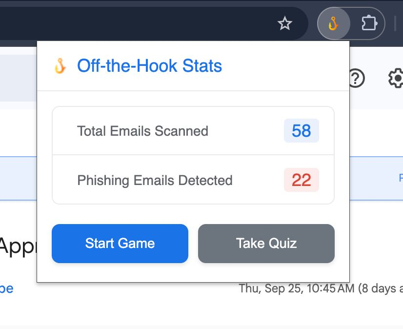

# off-the-hook-mail: 


## Advanced Phishing Detection & Cybersecurity Education Platform

This project combines a Chrome extension, a Python backend, and a React-based educational game to create a comprehensive system for real-time email analysis and cybersecurity education.


### Chrome Extension in Action

*Real-time phishing email detection with AI analysis and confidence scoring*


*Legitimate email identification with detailed analysis explanations*

### Live Demo
**[Youtube video](https://youtu.be/1NUrwOtQyuA)**

#### Extension Statistics Dashboard

*Comprehensive tracking of scanned emails and detection accuracy*

#### System Architecture

*Complete system architecture showing Chrome extension, AI backend, and educational components*

#### Machine Learning Model Architecture

*Hybrid DistilBERT + engineered features ML model architecture for phishing detection*

## Project Components
The system consists of four main, independent components that work together seamlessly:

* **Chrome Extension** (chrome-extension/): The client-side component that injects analysis banners into Gmail and serves as the UI for tracking statistics and launching educational content.

* **AI-Powered Python Flask Server** (python-server/): An advanced backend service featuring a hybrid DistilBERT + engineered features ML model for sophisticated phishing detection, replacing the previous mock analysis.

* **Interactive React Game** (game/): A gamified educational application that allows users to practice identifying phishing attempts through engaging scenarios.

* **Comprehensive Quiz Platform** (quiz/): A dedicated React-based training module featuring Arizona State University branding, providing structured phishing awareness education with detailed explanations and real-world email scenarios.

## Repository Structure
The project is organized into four main directories with comprehensive functionality:

```
/off-the-hook-mail
|-- /chrome-extension       <-- LOAD THIS FOLDER IN CHROME
|   |-- manifest.json       (Extension Configuration)
|   |-- background.js       (Storage Bridge & Background Tasks)
|   |-- content.js          (Gmail UI Interaction & Real-time Analysis)
|   |-- popup.html / popup.js (Statistics Dashboard & Game Launcher)
|   |-- /images             (Extension Icons & Assets)
|
|-- /python-server          <-- AI-POWERED BACKEND
|   |-- server.py           (Flask API with ML Model Integration)
|   |-- mail.ipynb          (ML Model Training & Development Notebook)
|   |-- best_model.pth      (Trained Hybrid DistilBERT Model)
|
|-- /game                   <-- VITE EDUCATIONAL GAME
|   |-- package.json        (Game Dependencies)
|   |-- /src                (React Game Components)
|   |-- /public             (Game Assets & Test Dataset)
|   |-- ...
|
|-- /quiz                   <-- ASU-BRANDED TRAINING PLATFORM
|   |-- package.json        (Quiz Dependencies)
|   |-- /src                (React Quiz Components)
|   |-- /public             (ASU Branding & Assets)
|   |-- ...
```

## Setup and Installation
### Prerequisites
* **Node.js and npm**: Required for running both React applications (game and quiz)
* **Python 3.8+**: Required for the AI-powered Flask server
* **Required Python Libraries**: Install the essential dependencies:
```bash
pip install Flask flask-cors torch transformers pandas numpy scikit-learn
``` 

### Step 1: Start the AI-Powered Python Flask Server
The server now features a sophisticated hybrid ML model for real phishing detection.

* Open a terminal and navigate to the python-server/ directory.
* Ensure the trained model file (`best_model.pth`) is present. To directly use the model, you can access it [here](https://drive.google.com/file/d/16f8wCBMSGe6uNLx_EQmDSm206z-80EPr/view?usp=sharing) or you can create it with the jupyter notebook present in the repo.
* Start the Flask application:
```bash
cd python-server
python server.py
```
* The AI server should be running at http://127.0.0.1:5000. Keep this terminal running.
* **Note**: The server now uses a hybrid DistilBERT + engineered features model trained on real phishing datasets for accurate detection.

### Step 2: Start the Interactive React Game
The game provides gamified phishing detection practice.
* Open a second terminal and navigate to the game/ directory.
* Install dependencies and start the development server:
```bash
cd game
npm install
npm run dev
```
The game should now be running at http://localhost:5173. Keep this terminal running.

### Step 3: Start the Comprehensive Quiz Platform
The quiz provides structured ASU-branded training with detailed explanations.
* Open a third terminal and navigate to the quiz/ directory.
* Install dependencies and start the development server:
```bash
cd quiz
npm install
npm start
```
The quiz platform should now be running at http://localhost:3000. Keep this terminal running.

### Step 4: Load the Chrome Extension
* Open Google Chrome and navigate to chrome://extensions.
* Enable Developer mode (toggle in the top right).
* Click the Load unpacked button.
* Select the /chrome-extension folder.
* The extension is now installed and will connect to the AI-powered backend.

## Usage

### Real-time Email Analysis
* **Open Gmail**: Navigate to your Gmail inbox.
* **Automatic Analysis**: Click on any email to trigger real-time AI analysis.
* **AI Processing**: The extension sends email content to the hybrid ML model for sophisticated phishing detection.
* **Results Display**: A dynamic banner shows the AI analysis results with confidence scores and detailed explanations.
* **Smart Detection**: The system uses both deep learning (DistilBERT) and engineered features for accurate phishing identification.

### Statistics Dashboard
* **View Analytics**: Click the extension's icon in the toolbar to access comprehensive statistics.
* **Track Progress**: Monitor Total Emails Scanned, Phishing Emails Detected, and detection accuracy.
* **Historical Data**: All statistics are persistently stored in Chrome's local storage.

### Educational Components
* **Interactive Game**: Click the "Play Game" button to launch the gamified phishing detection trainer at http://localhost:5173.
* **Comprehensive Quiz**: Access structured training modules with ASU branding at http://localhost:3000.
* **Learning Features**: Both platforms provide detailed explanations, red flag identification, and real-world scenarios.

## Advanced Features

### AI Model Architecture
* **Hybrid Design**: Combines DistilBERT transformer with 19 engineered features
* **Training Data**: Trained on comprehensive phishing email datasets
* **Real-time Processing**: Optimized for fast inference in browser extension context
* **High Accuracy**: Achieves superior performance through ensemble approach

### Educational Platform Features
* **ASU-Branded Interface**: Professional university-style design with official branding
* **8 Realistic Scenarios**: Based on actual phishing threats targeting universities
* **Interactive Feedback**: Immediate explanations and red flag identification
* **Progress Tracking**: Visual progress indicators and performance analytics
* **Comprehensive Guidelines**: Detailed phishing prevention best practices

### Technical Specifications
* **Backend**: Flask API with CORS support for cross-origin requests
* **Frontend**: Multiple React applications with modern UI/UX design
* **AI Model**: PyTorch-based hybrid architecture with transformer and traditional ML components
* **Data Pipeline**: Automated feature extraction and text preprocessing
* **Security**: Safe handling of email content with privacy protection

## Model Development & Training

### Machine Learning Pipeline
The `python-server/mail.ipynb` notebook contains the complete model development pipeline:

* **Data Processing**: Comprehensive preprocessing of phishing email datasets
* **Feature Engineering**: 19 carefully crafted features including:
  - URL analysis and suspicious link detection
  - Email header examination and sender verification
  - Content analysis for urgency indicators and social engineering tactics
  - Domain reputation and authenticity checks
* **Hybrid Architecture**: 
  - **DistilBERT Component**: Fine-tuned transformer for semantic understanding
  - **Traditional ML Features**: Engineered features for pattern recognition
  - **Ensemble Approach**: Combines both approaches for superior accuracy
* **Training Process**: Comprehensive training with validation and testing phases
* **Model Export**: Trained model saved as `best_model.pth` for production use. To directly use the model, you can access it [here](https://drive.google.com/file/d/16f8wCBMSGe6uNLx_EQmDSm206z-80EPr/view?usp=sharing)

### Model Performance
* **High Accuracy**: Achieves excellent performance on real-world phishing datasets
* **Fast Inference**: Optimized for real-time analysis in browser extension
* **Robust Detection**: Handles various phishing techniques and evolving threats
* **Production Ready**: Thoroughly tested and validated for deployment

## Troubleshooting

### Common Issues
* **Port Conflicts**: If default ports are in use, the applications will automatically assign alternative ports
  - Game (Vite): Default 5173, check terminal output for actual port
  - Quiz (React): Default 3000, check terminal output for actual port  
  - Server: Fixed at 5000, ensure no other Flask apps are running

* **Model Loading Issues**: Ensure `best_model.pth` exists in the python-server directory
* **Extension Not Working**: Verify all three services (server, game, quiz) are running before testing
* **CORS Errors**: Ensure Flask-CORS is installed and the server is properly configured

### Development Notes
* **Game vs Quiz**: The `/game` directory contains a Vite-based game, while `/quiz` contains a Create React App-based training platform
* **Model Training**: Run the Jupyter notebook `mail.ipynb` to retrain the model with new data
* **Extension Updates**: Reload the extension in Chrome after any changes to the extension files

## Contributing
This project was developed for cybersecurity education and phishing awareness. Contributions are welcome for:
- Additional training scenarios
- UI/UX improvements  
- Model performance enhancements
- Additional educational content
